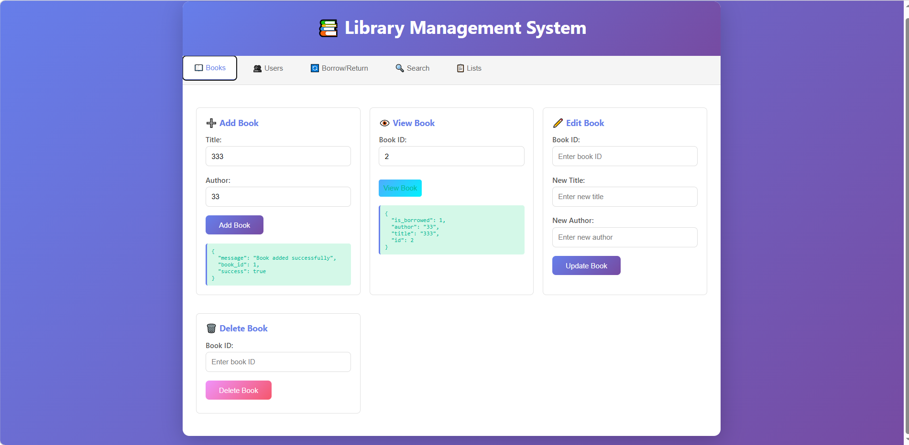

# 📚 Library Management System

Hệ thống quản lý thư viện với hai giao diện: **Console Application** (offline) và **Web Application** (API + Frontend).



## ✨ Tính năng

### 1. Quản lý Sách
- ➕ Thêm sách mới với thông tin: tiêu đề, tác giả, ID, trạng thái mượn
- ✏️ Chỉnh sửa thông tin sách
- 🗑️ Xóa sách khỏi hệ thống
- 🔍 Tìm kiếm sách theo tiêu đề hoặc tác giả
- 📋 Hiển thị danh sách tất cả sách và sách còn trống

### 2. Quản lý Người dùng
- ➕ Thêm người dùng với thông tin: tên, ID
- ✏️ Chỉnh sửa thông tin người dùng
- 🗑️ Xóa người dùng (tự động trả lại các sách đang mượn)
- 📋 Xem danh sách người dùng và sách đang mượn

### 3. Mượn/Trả Sách
- 📤 Mượn sách (kiểm tra tình trạng sách)
- 📥 Trả sách
- 📊 Theo dõi trạng thái mượn/trả

### 4. Xử lý Lỗi
- ✅ Kiểm tra dữ liệu đầu vào
- ⚠️ Xử lý các trường hợp: sách hết, người dùng không tồn tại, v.v.

## 🏗️ Kiến trúc

Dự án được tổ chức theo mô hình modular:

```
c_lib_book_manager/
├── inc/                    # Header files
│   ├── book.h             # Quản lý sách
│   ├── user.h             # Quản lý người dùng
│   ├── borrow.h           # Mượn/trả sách
│   ├── search.h           # Tìm kiếm
│   ├── database.h         # SQLite database
│   ├── error.h            # Xử lý lỗi
│   └── config.h           # Cấu hình
├── src/                    # Implementation
│   ├── book.c
│   ├── user.c
│   ├── borrow.c
│   ├── search.c
│   ├── database.c
│   └── error.c
├── main.c                  # Console app (offline)
├── main_web.cpp            # Web API server (Crow framework)
├── index.html              # Web frontend
└── CMakeLists.txt          # Build configuration
```

### Core Modules

- **book.c/h**: Thao tác CRUD cho sách - thêm, sửa, xóa, tìm kiếm
- **user.c/h**: Quản lý người dùng và danh sách sách đang mượn
- **borrow.c/h**: Logic mượn/trả sách với validation
- **search.c/h**: Tìm kiếm sách theo tiêu đề/tác giả, liệt kê danh sách
- **database.c/h**: Kết nối và thao tác SQLite database
- **error.c/h**: Định nghĩa mã lỗi và thông báo tập trung

## 🛠️ Yêu cầu hệ thống

### Phần mềm cần thiết

- **GCC/G++**: Compiler cho C và C++ (hỗ trợ C11 và C++17)
- **CMake**: >= 3.10 (build system)
- **SQLite3**: Development libraries
- **Crow Framework**: Header-only C++ web framework (đã có sẵn trong project)

### Cài đặt trên Ubuntu/Debian

```bash
sudo apt update
sudo apt install -y build-essential cmake libsqlite3-dev
```


## 🚀 Hướng dẫn Build

### 1. Clone hoặc tải project

```bash
cd /path/to/c_lib_book_manager
```

### 2. Tạo thư mục build

```bash
mkdir -p build
cd build
```

### 3. Cấu hình với CMake

```bash
cmake ..
```

### 4. Build project

```bash
make
```

Sau khi build thành công, bạn sẽ có 2 executable:
- `library` - Console application (~30KB)
- `library_web` - Web API server (~2.3MB)

### 5. Copy file HTML vào thư mục build

```bash
cp ../index.html .
```

## 📖 Hướng dẫn chạy

### Console Application (Offline)

```bash
cd build
./library
```

Menu console sẽ hiển thị 15 tùy chọn:

```
Library Management System
1. Add Book
2. Edit Book
3. Delete Book
4. Find Book
5. Add User
6. Edit User
7. Delete User
8. Find User
9. Borrow Book
10. Return Book
11. Search Book by Title
12. Search Book by Author
13. List All Books
14. List All Users
0. Exit
```

### Web Application

#### Bước 1: Khởi động server

```bash
cd build
./library_web
```

Server sẽ khởi động trên cổng **8080**:

```
(2026-03-07 18:30:00) [INFO    ] Crow/master server is running at http://0.0.0.0:8080
```

#### Bước 2: Mở trình duyệt

Truy cập: **http://localhost:8080**

Giao diện web có 5 tabs:
- 📖 **Books**: Thêm, xem, sửa, xóa sách
- 👤 **Users**: Thêm, xem, sửa, xóa người dùng
- 📚 **Borrow/Return**: Mượn và trả sách
- 🔍 **Search**: Tìm kiếm sách theo tiêu đề/tác giả
- 📋 **Lists**: Xem danh sách tất cả sách và người dùng

#### REST API Endpoints

Server cung cấp 15 API endpoints:

**Books:**
- `GET /api/books/available` - Danh sách sách còn trống
- `POST /api/books` - Thêm sách mới
- `GET /api/books/:id` - Xem thông tin sách
- `PUT /api/books/:id` - Cập nhật sách
- `DELETE /api/books/:id` - Xóa sách

**Users:**
- `GET /api/users` - Danh sách người dùng
- `POST /api/users` - Thêm người dùng
- `GET /api/users/:id` - Xem thông tin người dùng
- `PUT /api/users/:id` - Cập nhật người dùng
- `DELETE /api/users/:id` - Xóa người dùng

**Borrow/Return:**
- `POST /api/borrow` - Mượn sách
- `POST /api/return` - Trả sách

**Search:**
- `GET /api/search/title/:title` - Tìm theo tiêu đề
- `GET /api/search/author/:author` - Tìm theo tác giả

**Lists:**
- `GET /api/list/books` - Tất cả sách
- `GET /api/list/users` - Tất cả người dùng

## 💾 Database

Hệ thống sử dụng **SQLite3** để lưu trữ dữ liệu trong file `library.db`:

### Cấu trúc bảng

**books:**
```sql
CREATE TABLE books (
    id INTEGER PRIMARY KEY AUTOINCREMENT,
    title TEXT NOT NULL,
    author TEXT NOT NULL,
    is_borrowed INTEGER DEFAULT 0
);
```

**users:**
```sql
CREATE TABLE users (
    id INTEGER PRIMARY KEY AUTOINCREMENT,
    name TEXT NOT NULL
);
```

**borrowed_books:**
```sql
CREATE TABLE borrowed_books (
    id INTEGER PRIMARY KEY AUTOINCREMENT,
    book_id INTEGER,
    user_id INTEGER,
    FOREIGN KEY(book_id) REFERENCES books(id),
    FOREIGN KEY(user_id) REFERENCES users(id)
);
```


## 🧪 Testing

### Test Console App

```bash
cd build
./library
# Thử các chức năng: thêm sách, thêm user, mượn/trả sách
```

### Test Web API

```bash
# Trong terminal khác (khi server đang chạy):

# GET: Lấy danh sách sách
curl http://localhost:8080/api/list/books | python3 -m json.tool

# POST: Thêm sách mới
curl -X POST http://localhost:8080/api/books \
  -H "Content-Type: application/json" \
  -d '{"title":"The Great Gatsby","author":"F. Scott Fitzgerald"}'

# GET: Xem thông tin sách
curl http://localhost:8080/api/books/1 | python3 -m json.tool
```

## 🐛 Troubleshooting

### Lỗi "Database not initialized"
```bash
# Đảm bảo chạy từ thư mục build hoặc có file library.db
cd build
./library_web
```

### Lỗi "404 Not Found" khi truy cập web
```bash
# Copy index.html vào thư mục build
cp ../index.html build/
```

### Port 8080 đã được sử dụng
```bash
# Tìm và dừng process đang dùng port 8080
lsof -ti:8080 | xargs kill -9
```

### Rebuild sau khi sửa code
```bash
cd build
make clean
make
```

